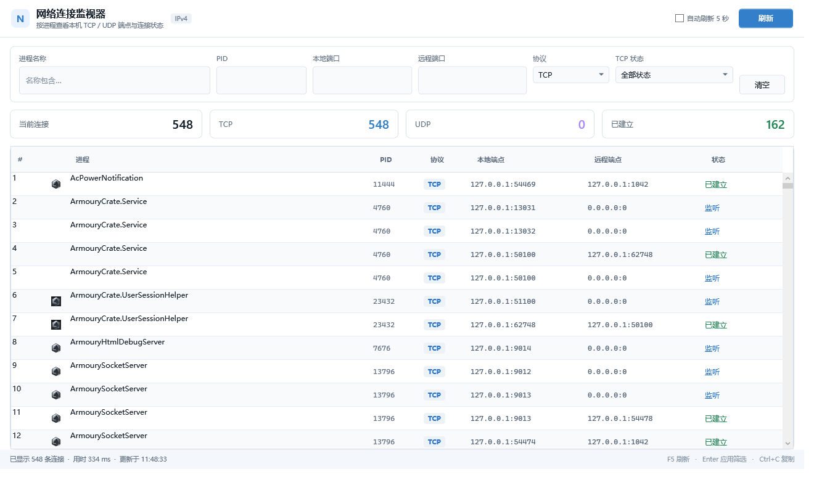

# NetStatusSharp

[中文说明](README.md)

NetStatusSharp is a lightweight Windows network connection monitor for inspecting and filtering local IPv4 TCP and UDP connections by process.



## Features

- View process name, PID, local endpoint, remote endpoint, and TCP state
- Filter by process name, PID, local port, remote port, protocol, and TCP state
- Light, high-DPI WPF interface with row virtualization, column sorting, and multi-row copy
- Asynchronous, cancellable refreshes that keep the interface responsive
- Resolve each PID only once per refresh and filter connections before loading process metadata
- Optional five-second automatic refresh with result count, duration, and update time

## Keyboard shortcuts

- `F5`: refresh
- `Enter`: apply text-box filters
- `Esc`: cancel the active refresh
- `Ctrl+L`: clear filters
- `Ctrl+C`: copy selected connections

## Solution layout

- `NetStatusSharp/`: .NET 8 WPF application, MVVM, theme, and connection query service
- `NetStatusAPI/`: wrapper for the native Windows TCP and UDP connection tables
- `NetStatusSharp.sln`: Visual Studio solution

## Technical details

- Target framework: `.NET 8 (net8.0-windows)`
- UI: `WPF`
- Native APIs: `GetExtendedTcpTable` and `GetExtendedUdpTable`
- Current connection scope: IPv4
- Platform: Windows 10 or later

## Build and run

Use Visual Studio 2022 with the .NET desktop development workload or the .NET 8 SDK.

```powershell
dotnet build .\NetStatusSharp.sln -c Release
dotnet run --project .\NetStatusSharp\NetStatusSharp.csproj -c Release
```

The regular build requires the .NET 8 Desktop Runtime. To create a self-contained single-file build:

```powershell
dotnet publish .\NetStatusSharp\NetStatusSharp.csproj -c Release -r win-x64 --self-contained true -p:PublishSingleFile=true -p:IncludeNativeLibrariesForSelfExtract=true
```

The GitHub Release workflow automatically creates a self-contained `win-x64` archive.

## License

This project is licensed under the [Selective Freedom License (SFL) v1.0](https://github.com/bighamx/MIT-NoHuawei). See the [LICENSE](LICENSE) file.
